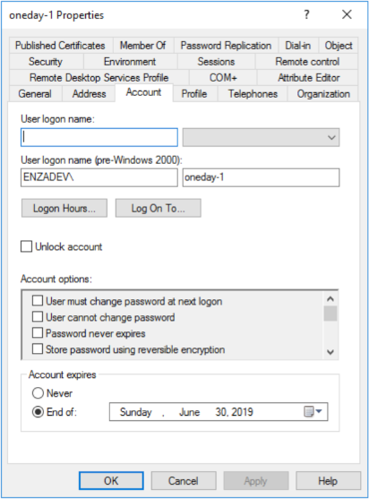
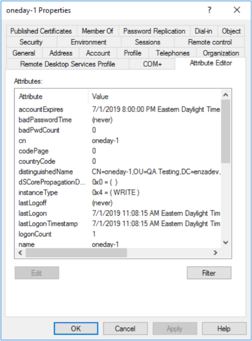

[title]: # (AD Account Expiration Dates)
[tags]: # (Account Lifecycle Manager,ALM,Active Directory,)
[priority]: # (2400)

# AD Account Expiration Dates

When working with account expiration dates in Active Directory, you may notice that Active Directory accounts do not always expire when it seems they should. This issue, which is external to ALM, traces back to a purely abstract linguistics problem that has confounded the software industry from its earliest days.

In the case of Active Directory, the problem shows up in the convoluted relationship between Active Directory’s **Account expires** entry (on the Account tab of AD’s Account Properties dialog) and its **accountExpires** attribute (visible on the Attribute Editor tab).

 

In a typical environment, **Account expires** and **accountExpires** may appear to be out of sync. As an example, in the illustration above The **Account expires** entry indicates that the account should expire at the “End of” the day entered on the Account tab, while **accountExpires** shows the account expiring at 8:00 PM the following day.

## Computing’s Midnight Conundrum

As a representation of time, the word “midnight” denotes the instant marking the end of one day and the beginning of the next. Conceptually, an instant has a duration of zero, but our time keeping systems depend on units defined as intervals of time: seconds, minutes, and hours.

* We can tidily represent the instant that **begins** a new day as 00:00, or more traditionally, as 12:00 AM, but we have no similarly tidy way to represent the instant that **ends** a day.

* The time of 11:59:59 leaves one second on the clock, so it cannot be used to denote the end of a day. Using 12:00 to denote the end of the day and 00:00 to denote the beginning would be sensible, but culture is not always sensible; by tradition, 12:00 belongs to the new day it begins, hence the notation 12:00 AM.

This leaves no commonly recognized way for software to symbolically represent the instant (“the time of day”) that marks the end of a day. With no other option, Active Directory encodes the “End of” day entry as 12:00 AM the next day. While logically equivalent to the end of the day, by formal definition 12:00 AM is no part of the day just ended; it is part of the morning of the day just beginning. If you set the “End of” day entry to a Wednesday, the time value recorded, when strictly interpreted, evaluates as Thursday.

In Active Directory, the **accountExpires** attribute is defined as 12:00 AM UTC of the day **after** the **last full day** that the account was active. When Active Directory applies this definition to the incorrect, already-one-day-forward entry in the **Account expires** field, it kicks the value of the **accountExpires** attribute out 24 hours past what would be correct. Finally, in rendering that 12:00 AM UTC value in the UI, Active Directory considers the local time zone.

In the illustrated example, it works out like this:

* The **Account expires** field’s “End of” day entry shows June 30. For want of a way to denote the last instant of June 30, this records as 12:00 AM UTC July 1.

* The **accountExpires** attribute, being defined as 12:00 AM UTC of the day after the last full day the account was active, accordingly calculates to 12:00 AM UTC July 2.

* In displaying 12:00 AM UTC July 2 as the **accountExpires** attribute value, Active Directory adjusts for the time zone context; in the example, with the context being Eastern Daylight Time, this works out to 8:00 PM July 1.

In the final outcome, the entries do not align, creating a substantial time window for an account to remain active beyond the end of day it is supposed to expire.

Efforts by Microsoft to fix this issue face challenges having nothing to do with the technical aspects, such as the imperative to remain interoperable with the world’s installed base of software, and the risk that by correcting a problem you will break all the workarounds to the problem, causing widespread problems for your customers and other software vendors. For these and many other reasons, peculiarities related to account expiration persist in Active Directory.

If you would like to learn more about this longstanding, solutions-resistant issue, visit Richard Mueller’s classic treatment of the topic:

[Account Expiration Article by Richard Mueller](http://www.rlmueller.net/AccountExpires.htm)

