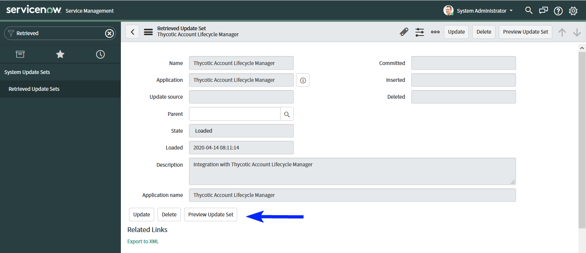
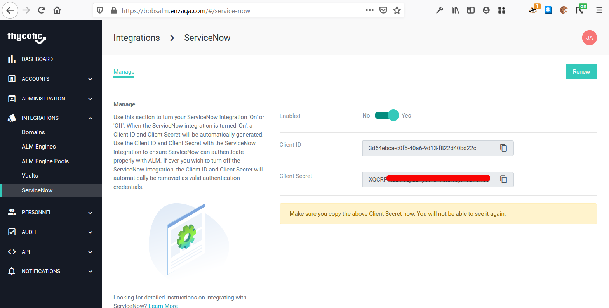

[title]: # (ServiceNow Integration)
[tags]: # (Account Lifecycle Manager,ALM,ServiceNow)
[priority]: # (5195)

# ServiceNow Integration (Beta)

ServiceNow delivers popular IT service management solutions. Organizations that employ both Account Lifecycle Manager and ServiceNow IT Service Management can benefit from an integrated workflow. 

The April release of ALM provides a beta version of the integration to ServiceNow to interact with the Request Approval process for ALM accounts. 

As much of other IT management operations are handled in ServiceNow by organizations, now too can service account approvals.

## Beta Notes:

* The beta version of the integration only allows for Approvals of Requests generated by ALM.
* Requests viewed in ServiceNow can only be Approved, the option to Reject requests is not available in the beta. 
* It is not recommended to request production service accounts with the beta version of the ServiceNow integration with ALM. The beta version is intended for testing the integration with non-business critical accounts.
* It is recommended that when adding ServiceNow as an Approver in an ALM Workflow Template that a User, or Group, is added to the same Approval Step. The Approval Step should have a minimum approval count requirement that can be satisfied only by the Users and/or Groups that are in the Approval Step. This allows the Approval Step to be satisfied in the event that the beta ServiceNow integration is unsuccessful of providing the Approval. 

## Download the Thycotic ALM ServiceNow App:

* Log into the ServiceNow Developer Share portal by browsing to https://developer.servicenow.com/connect.do#!/share, and then sign in.

* In the “Search Share Projects” field, enter “Thycotic”. Thycotic Account Lifecycle Manager should appear in the results. Click the name to view details.

    

* Click the Download button. This should start the download of the app, in the form of an XML file.

    

## Install the Thycotic ALM ServiceNow App:

* Log in to your instance as a user with the admin role.

* In the navigation menu, go to **System Update Sets** > **Retrieved Update Set**.

    

* Click Import Update Set from XML under the Related Links section.

    

* Click Browse..

    * Find and Open the XML file that was previously downloaded.

    * Click Upload.

      

* Thycotic Account Lifecycle Manager should now appear in the list of Retrieved Update Sets records.

* Click Thycotic Account Lifecycle Manager under the Name column to open up the record.

    

*  Click **Preview Update Set**. An Update Set Preview dialog will appears. Click Close when it is finished.

    
    

* Click **Commit Update Set**. An Update Set Commit dialog will appear. Click Close when it is finished.
    
    
    

* **Done!** The app should now be installed in the ServiceNow instance. 
    * Reload ServiceNow in your browser.
    * Thycotic Account Lifecycle Manager should now be available in the navigation menu.
    
    

## Thycotic ALM ServiceNow App Roles:

In order to access the Thycotic ALM app within ServiceNow, a user must have the admin role or be assigned one of the following roles:

| Role Name           | Role Description |
|---------------------|-------------------------------|
| alm_admin (x_450483_alm_poc.alm_admin)| Provides a user with the ability to create and modify the Configuration for ALM. The Configuration determines which ALM instance ServiceNow will connect to and which credentials are used.|
| alm_approver (x_450483_alm_poc.alm_approver)| Provides a user with the ability to view and approve any ALM request that requires ServiceNow approval.|

## Thycotic ALM ServiceNow App Configuration

* Sign into your ALM instance as a user with the System Administrator role.

* Navigate to **Integrations** > **ServiceNow**

    

* Click **Enable**.

* Copy the **Client ID** and **Client Secret** that are provided.
   
    

* Sign into your ServiceNow instance as user with the alm_admin role.

* Navigate to **Thycotic Account Lifecycle Manager > ALM Configuration**.

* Click the **New** button.

    

* In the new ALM Configuration record, provide:
    * **URL** for your ALM instance
    * **API Client Id** and **API Client Secret** that were given in previous steps
    * Click the **Connect** button.

    

* A message should appear indicating that the “Connection succeeded”. If you receive an error, please double-check the values that were entered.

    

* **Done!** Once the connection has been set up successfully, ServiceNow will be ready to receive requests from ALM.

