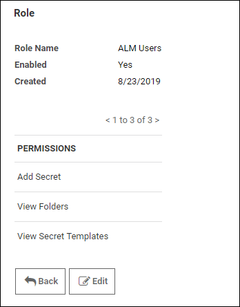

[title]: # (Integrate ALM with Secret Server)
[tags]: # (Account Lifecycle Manager,ALM,Active Directory,)
[priority]: # (5140)

# Integrate ALM with Secret Server

ALM integrates with Secret Server for storage and management of account credentials, connecting to Secret Server through the Remote Worker service, which uses the Secret Server Rest API. If you use an on-premises installation of Secret Server, the version must be **10.2.000018** or later.

Because Account Lifecycle Manager works with Secret Server through Secret Server’s web services, you must enable those services on your Secret Server instance.

Use these steps to enable the Secret Server web services:

* Log in to Secret Server as an Administrator and navigate to **Admin \> Configuration**.

* On the **General** tab, under **Application Settings**, find the entry for **Enable Webservices**.

* If the entry displays as **No**, you must change it.

  * Use the **Edit** button found below the settings to reveal controls for making changes.

  * Set the toggle box for **Enable Webservices** to active.

  * Use the **Save** button below the settings to save the change.

You must also set up a Secret Server account for ALM that has privileges to:

* view folders accessible to ALM users

* create Secrets in those folders

* view Secret Template permissions

To integrate ALM with Secret Server, use these steps:

* In ALM, navigate to **Integrations** and select **Create Vault**.

* Use the drop-down to select the **Template type**.

* Enter your organization’s **Secret Server Instance Name**, **Secret Server URL**, and the **Account Username** and **Password** for the Secret Server account that will run this integration.

* Thycotic recommends creating a Secret Server Application Account with the minimum permissions.

You must use a template with the following fields, and you must not add new required fields to the template:

* domain

* username

* password

* notes

